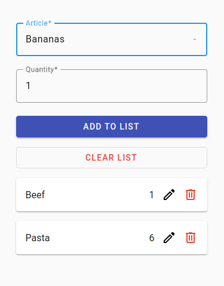

# Grocery List web app with Angular and Spring Boot
This project is my first full stack web application using Angular and Spring Boot.  
It demos CRUD operations on a grocery list with a REST API.  
The data is stored in an H2 database (in-memory SQL).  

This app was deployed on Heroku.

Note that the app sleeps after 30 minutes of inactivity.  
In this case, you can expect around 10 seconds of load time.

## Screenshot

## Tech Stack
### Front End
- [Angular](https://angular.io/)
- [TypeScript](https://www.typescriptlang.org/)
- [SCSS](https://sass-lang.com/)
- [Angular Material](https://material.angular.io/)
- [Material Symbols](https://fonts.google.com/icons)

### Back End
- [Java SE 17](https://docs.oracle.com/en/java/javase/17/)
- [Spring Boot](https://spring.io/projects/spring-boot)
- [Spring Web MVC](https://docs.spring.io/spring-framework/reference/web/webmvc.html)
- [Spring Data JPA](https://spring.io/projects/spring-data-jpa)
- [H2 Database](https://www.h2database.com/html/main.html)
- [Heroku](https://www.heroku.com/)

### [Maven](https://maven.apache.org/) Plugins
- spring-boot-maven-plugin
- frontend-maven-plugin

## Dev Tools
- [IntelliJ IDEA](https://www.jetbrains.com/idea/)
- [Visual Studio Code](https://code.visualstudio.com/)
- [Angular CLI](https://angular.io/cli)
- [Chrome DevTools](https://developer.chrome.com/docs/devtools/)
- [GitHub Copilot](https://github.com/features/copilot) extension
- [CodeQL](https://codeql.github.com/) with [GitHub Actions](https://github.com/features/actions)
- [Spring Initializr](https://start.spring.io/)
- [Spring Boot DevTools](https://docs.spring.io/spring-boot/docs/current/reference/html/using.html#using.devtools)

## Copyright
© 2023 Johnny Gérard
